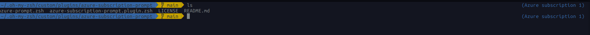

# Azure Subscription Prompt

This script displays information about the Azure current Subscription and tenant.

This script heavily inspired by [zsh-kubectl-prompt](https://github.com/superbrothers/zsh-kubectl-prompt)




## Usage

1. Clone this repository into `$HOME/.oh-my-zsh/custom/plugins`.
2. Add plugin name to `.zshrc`
3. Add following lines into `.zshrc`

    ```bash
    autoload -U colors; colors
    RPROMPT='%{$fg[blue]%}($ZSH_SUBSCRIPTION_PROMPT)%{$reset_color%}'
    ```
4. Reload terminal or update `.zshrc`

    ```bash
    source ~/.zshrc
    ```

## License

This script is released under the MIT License.
